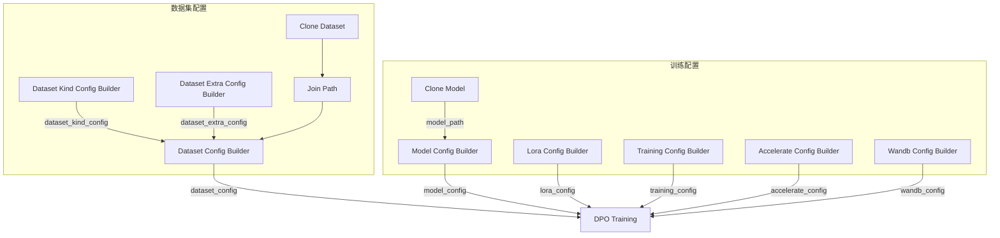

## 前置条件

- 已完成 [SFT 监督微调](/zh/docs/studio/sft-training)，获得基线模型
- 已准备包含 preferred / rejected 回答的偏好对数据集

## 什么是 DPO

**DPO（Direct Preference Optimization）** 直接利用偏好对数据优化模型，无需单独训练 reward 模型。相比 GRPO，DPO 更适合已有明确偏好标注（chosen vs rejected）的场景。

## 导入 DPO 工作流

1. 下载 DPO 工作流：<a href="/resource/studio/jsons/DPO.json" target="_blank" rel="noreferrer">DPO</a>
2. 将 JSON 文件拖入 Studio 画布。
3. 按下方说明配置各节点参数。

## 数据格式要求

DPO 数据集的字段映射在 **Dataset Kind Config Builder (Text Only)** 节点中配置，输出连接到 **Dataset Config Builder** 的 `dataset_kind_config`：

| 字段 | 说明 |
|------|------|
| `assistant_response_field` | 首选回答（chosen），默认 `gt` |
| `rejected_field` | 被拒绝回答（rejected），默认 `rejected_answer` |
| `user_prompt_field` | 用户输入字段 |

示例数据：`pyromind/alpaca-gpt4-llm-demo` 数据集中的 `alpaca_gpt4_demo.dpo.jsonl`，每条样本包含用户问题、首选回答与被拒绝回答。

## 工作流节点说明

DPO 工作流与 SFT 工作流结构类似，训练执行节点替换为 **DPO Training**：

| 节点 | 说明 |
|------|------|
| Dataset Kind Config Builder (Text Only) | 配置偏好对字段映射，需设置 `rejected_field` |
| Dataset Config Builder | 汇总数据路径与 `dataset_kind_config` |
| Model Config Builder | 加载 SFT checkpoint 作为初始策略（`model_path`） |
| Lora Config Builder | LoRA rank、dropout、目标模块等 |
| Training Config Builder | DPO 超参数（默认学习率 `1e-6`，batch size 2） |
| DPO Training | 执行 DPO 偏好优化训练 |

## 典型连接方式

DPO 工作流的数据与模型配置连接同 [SFT 监督微调 — 典型连接方式](/zh/docs/studio/sft-training#典型连接方式)，仅将训练执行节点替换为 **DPO Training**：

| 源节点 | 输出端口 | 目标节点 | 输入端口 |
|--------|----------|----------|----------|
| Dataset Config Builder | `dataset_config` | DPO Training | `dataset_config` |
| Model Config Builder | `model_config` | DPO Training | `model_config` |
| Lora Config Builder | `lora_config` | DPO Training | `lora_config` |
| Training Config Builder | `training_config` | DPO Training | `training_config` |
| Accelerate Config Builder | `accelerate_config` | DPO Training | `accelerate_config` |
| Wandb Config Builder | `wandb_config` | DPO Training | `wandb_config` |

其余数据路径与 `model_path` 连线见 [SFT 监督微调](/zh/docs/studio/sft-training#典型连接方式)。

## 配置训练参数

| 参数 | 节点 | 说明 |
|------|------|------|
| 初始模型 | Model Config Builder | SFT checkpoint 路径填入 `model_path` |
| LoRA | Lora Config Builder | `lora_rank` 默认 8，推荐开启以降低显存占用 |
| 学习率 | Training Config Builder | 通常低于 SFT 阶段（默认 `1e-6`） |
| Batch size | Training Config Builder | DPO 需同时加载 chosen 与 rejected，默认 batch size 2 |
| 输出路径 | DPO Training | 设置 `output_path` 保存 checkpoint |

## 运行训练

1. 确认数据集包含完整的 chosen / rejected 对，且 **Dataset Validator** 校验通过。
2. 检查各 Config Builder 节点连线与参数。
3. 点击 **运行**，在任务详情中查看 loss 曲线与日志。

## 产出物

- DPO 对齐后的模型权重（或 LoRA 适配器）
- 训练日志与 checkpoint 路径

## 下一步

- [模型的验证](/zh/docs/studio/model-validation) — 对比 SFT 与 DPO 模型效果
- [模型的推理和服务](/zh/docs/studio/model-inference-deployment) — 部署对齐后的 checkpoint
