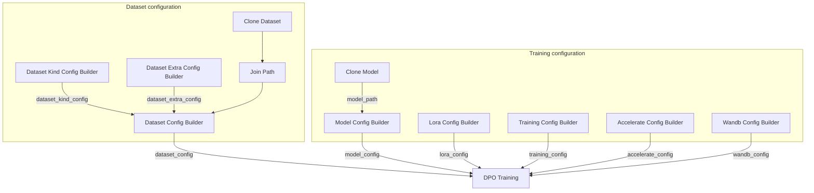

## Prerequisites

- You have completed [Train with SFT](/docs/studio/sft-training) and obtained a baseline model
- You have prepared a preference-pair dataset containing preferred/rejected responses

## What is DPO

**DPO (Direct Preference Optimization)** optimizes models directly from preference-pair data without training a separate reward model. Compared with GRPO, DPO is better suited to scenarios with explicit preference labels (chosen vs. rejected).

## Import the DPO workflow

1. Download the DPO workflow: <a href="/resource/studio/jsons/DPO.json" target="_blank" rel="noreferrer">DPO</a>
2. Drag the JSON file into the Studio canvas.
3. Configure each node as described below.

## Data format requirements

Configure DPO field mappings in **Dataset Kind Config Builder (Text Only)**, then connect its output to `dataset_kind_config` in **Dataset Config Builder**:

| Field | Description |
|------|------|
| `assistant_response_field` | Preferred response (chosen), default `gt` |
| `rejected_field` | Rejected response, default `rejected_answer` |
| `user_prompt_field` | User input field |

Example dataset: `pyromind/alpaca-gpt4-llm-demo` with `alpaca_gpt4_demo.dpo.jsonl`, where each sample includes a user prompt, a chosen response, and a rejected response.

## Workflow nodes

The DPO workflow is structurally similar to SFT, with **DPO Training** as the execution node:

| Node | Description |
|------|------|
| Dataset Kind Config Builder (Text Only) | Configure preference-pair fields; must set `rejected_field` |
| Dataset Config Builder | Combine data paths and `dataset_kind_config` |
| Model Config Builder | Load SFT checkpoint as the initial policy (`model_path`) |
| Lora Config Builder | LoRA rank, dropout, target modules, and more |
| Training Config Builder | DPO hyperparameters (default learning rate `1e-6`, batch size 2) |
| DPO Training | Execute DPO preference optimization |

## Typical connection pattern

DPO uses the same data/model connection pattern as [Train with SFT - Typical connection pattern](/docs/studio/sft-training#typical-connection-pattern), replacing the execution node with **DPO Training**:

| Source node | Output port | Target node | Input port |
|--------|----------|----------|----------|
| Dataset Config Builder | `dataset_config` | DPO Training | `dataset_config` |
| Model Config Builder | `model_config` | DPO Training | `model_config` |
| Lora Config Builder | `lora_config` | DPO Training | `lora_config` |
| Training Config Builder | `training_config` | DPO Training | `training_config` |
| Accelerate Config Builder | `accelerate_config` | DPO Training | `accelerate_config` |
| Wandb Config Builder | `wandb_config` | DPO Training | `wandb_config` |

For data path and `model_path` wiring, refer to [Train with SFT](/docs/studio/sft-training#typical-connection-pattern).

## Configure training parameters

| Parameter | Node | Description |
|------|------|------|
| Initial model | Model Config Builder | Set SFT checkpoint path in `model_path` |
| LoRA | Lora Config Builder | `lora_rank` defaults to 8; enabling LoRA is recommended to reduce memory usage |
| Learning rate | Training Config Builder | Usually lower than SFT (default `1e-6`) |
| Batch size | Training Config Builder | DPO loads chosen and rejected responses together; default batch size 2 |
| Output path | DPO Training | Set `output_path` to store checkpoints |

## Run training

1. Confirm the dataset has complete chosen/rejected pairs and passes **Dataset Validator** checks.
2. Verify all Config Builder node wiring and parameters.
3. Click **Run**, then review loss curves and logs in task details.

## Artifacts

- DPO-aligned model weights (or LoRA adapters)
- Training logs and checkpoint paths

## Next steps

- [Model validation](/docs/studio/model-validation) - Compare SFT and DPO model quality
- [Model inference and serving](/docs/studio/model-inference-deployment) - Deploy aligned checkpoints
