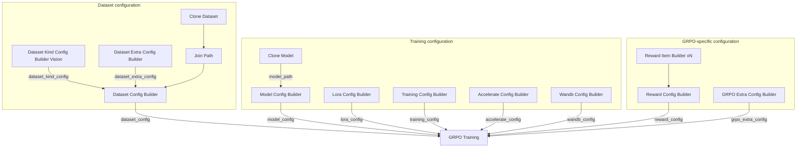

## Prerequisites

- You have completed [Train with SFT](/docs/studio/sft-training)
- You have [written reward functions](/docs/studio/reward-function)

## Import the GRPO workflow

1. Download the GRPO workflow: <a href="/resource/studio/jsons/GRPO.json" target="_blank" rel="noreferrer">GRPO</a>
2. Drag the JSON file into the Studio canvas.
3. Configure each node as described below.

## Workflow nodes

The GRPO workflow extends SFT with reward and GRPO-specific configuration nodes:

| Node | Description |
|------|------|
| Clone Dataset / Join Path | Load VLM datasets (example: `pyromind/geometry-vqa-vlm-demo` -> `multimodal-open-r1-test.jsonl`) |
| Clone Model | Pull the base model (example: `Qwen/Qwen3-VL-4B-Instruct`) |
| Dataset Kind Config Builder (Vision) | Configure multimodal field mapping (such as `image_field: image_path`) |
| Dataset Config Builder | Combine data paths and `dataset_kind_config` |
| Model Config Builder | Configure model path (`model_path`) and type (`model_type`) |
| Lora Config Builder | Configure LoRA parameters |
| Training Config Builder | Configure training hyperparameters (learning rate is usually lower than SFT) |
| Reward Item Builder | Define a single reward item (entry function, name, weight) |
| Reward Config Builder | Combine multiple reward items into one reward configuration |
| GRPO Training Extra Config Builder | Configure GRPO-specific parameters, such as group size, temperature, and max generation length |
| GRPO Training | Execute GRPO reinforcement learning |

## Typical connection pattern

GRPO follows [Train with SFT - Typical connection pattern](/docs/studio/sft-training#typical-connection-pattern) for data and model configuration, then adds reward and GRPO-specific configs with **GRPO Training** as the execution node:

For reward setup and validation, see [Write reward functions](/docs/studio/reward-function).

| Source node | Output port | Target node | Input port |
|--------|----------|----------|----------|
| Reward Item Builder | `reward_item` | Reward Config Builder | `reward_item_1` ... `reward_item_5` |
| Reward Config Builder | `reward_config` | GRPO Training | `reward_config` |
| GRPO Training Extra Config Builder | `grpo_extra_config` | GRPO Training | `grpo_extra_config` |

For other data path and model config wiring, refer to [Train with SFT](/docs/studio/sft-training#typical-connection-pattern).

## GRPO training flow

1. The model samples multiple candidate outputs (a group) for the same input.
2. Reward functions score each candidate.
3. The policy is updated by relative ranking within the group, increasing the probability of high-quality outputs.

## Key parameters

| Parameter | Node | Description |
|------|------|------|
| `num_generations` | GRPO Training Extra Config Builder | Number of sampled candidates per input (default 4) |
| `temperature` | GRPO Training Extra Config Builder | Sampling temperature (default 0.7) |
| `max_completion_length` | GRPO Training Extra Config Builder | Maximum tokens per generation (default 200) |
| `max_prompt_length` | GRPO Training Extra Config Builder | Maximum prompt length (default 20000) |
| `learning_rate` | Training Config Builder | Usually lower than in SFT (default `1e-6`) |
| Reward weight | Reward Item Builder | `weight` for each reward component |

## Run and monitor

1. Confirm checkpoint path, dataset path, and reward node configuration.
2. Start training and monitor average reward and policy loss.
3. If reward plateaus or output quality degrades, review reward sparsity and penalty strength.

## Next steps

- [Model validation](/docs/studio/model-validation) - Compare SFT and GRPO model quality
- [Model inference and serving](/docs/studio/model-inference-deployment) - Deploy the best checkpoint
