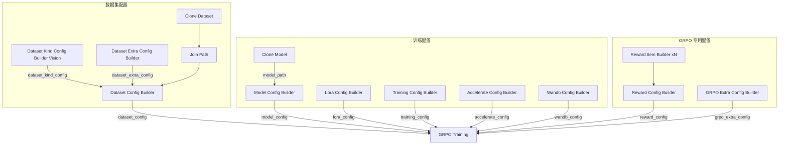

## 前置条件

- 已完成 [SFT 监督微调](/zh/docs/studio/sft-training)
- 已 [编写 reward 函数](/zh/docs/studio/reward-function)

## 导入 GRPO 工作流

1. 下载 GRPO 工作流：<a href="/resource/studio/jsons/GRPO.json" target="_blank" rel="noreferrer">GRPO</a>
2. 将 JSON 文件拖入 Studio 画布。
3. 按下方说明配置各节点参数。

## 工作流节点说明

GRPO 工作流在 SFT 工作流基础上增加了 reward 与 GRPO 专用配置节点：

| 节点 | 说明 |
|------|------|
| Clone Dataset / Join Path | 加载 VLM 数据集（示例：`pyromind/geometry-vqa-vlm-demo` → `multimodal-open-r1-test.jsonl`） |
| Clone Model | 拉取基座模型（示例：`Qwen/Qwen3-VL-4B-Instruct`） |
| Dataset Kind Config Builder (Vision) | 图文字段映射（`image_field: image_path` 等） |
| Dataset Config Builder | 汇总数据路径与 `dataset_kind_config` |
| Model Config Builder | 模型路径（`model_path`）与类型（`model_type`） |
| Lora Config Builder | LoRA 配置 |
| Training Config Builder | 训练超参数（学习率通常低于 SFT） |
| Reward Item Builder | 定义单个 reward 项（入口函数、名称、权重） |
| Reward Config Builder | 组合多个 reward 项，生成完整 reward 配置 |
| GRPO Training Extra Config Builder | 组采样数、温度、最大生成长度等 GRPO 专用参数 |
| GRPO Training | 执行 GRPO 强化学习训练 |

## 典型连接方式

GRPO 在 [SFT 监督微调 — 典型连接方式](/zh/docs/studio/sft-training#典型连接方式) 的数据与模型配置基础上，增加 reward 与 GRPO 专用配置，训练节点替换为 **GRPO Training**：

Reward 项配置与验证详见 [编写 reward 函数](/zh/docs/studio/reward-function)。

| 源节点 | 输出端口 | 目标节点 | 输入端口 |
|--------|----------|----------|----------|
| Reward Item Builder | `reward_item` | Reward Config Builder | `reward_item_1` … `reward_item_5` |
| Reward Config Builder | `reward_config` | GRPO Training | `reward_config` |
| GRPO Training Extra Config Builder | `grpo_extra_config` | GRPO Training | `grpo_extra_config` |

其余数据路径与模型配置连线见 [SFT 监督微调](/zh/docs/studio/sft-training#典型连接方式)。

## GRPO 训练流程

1. 模型对同一输入采样多组候选输出（group）。
2. Reward 函数对每组输出打分。
3. 按组内相对优劣更新策略，提升高质量输出的概率。

## 关键参数

| 参数 | 节点 | 说明 |
|------|------|------|
| `num_generations` | GRPO Training Extra Config Builder | 每个输入采样的候选数量（默认 4） |
| `temperature` | GRPO Training Extra Config Builder | 采样温度（默认 0.7） |
| `max_completion_length` | GRPO Training Extra Config Builder | 单次生成的最大 token 数（默认 200） |
| `max_prompt_length` | GRPO Training Extra Config Builder | 最大 prompt 长度（默认 20000） |
| `learning_rate` | Training Config Builder | 通常低于 SFT 阶段（默认 `1e-6`） |
| Reward 权重 | Reward Item Builder | 各子 reward 项的 `weight` 系数 |

## 运行与监控

1. 确认 checkpoint 路径、数据集路径与 reward 节点配置正确。
2. 启动训练，关注 reward 均值与策略 loss。
3. 若 reward 长期不升或输出退化，检查 reward 函数是否过于稀疏或惩罚过重。

## 下一步

- [模型的验证](/zh/docs/studio/model-validation) — 对比 SFT 与 GRPO 模型效果
- [模型的推理和服务](/zh/docs/studio/model-inference-deployment) — 部署最优 checkpoint
