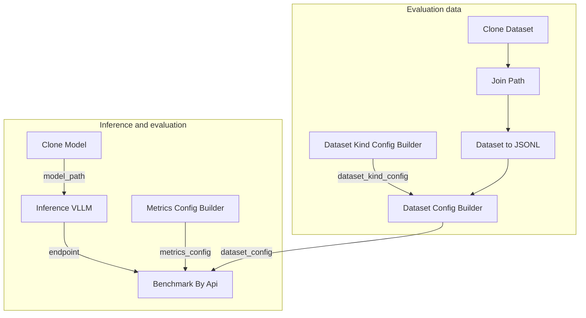

## Prerequisites

- You have completed [Train with SFT](/docs/studio/sft-training), [Train with DPO](/docs/studio/dpo-training), or [Train with GRPO](/docs/studio/grpo-training)
- For batch evaluation, prepare an evaluation dataset (you can use the same process in [Load and preprocess datasets](/docs/studio/load-preprocess-dataset))

## Validation methods overview

| Method | Best for |
|------|----------|
| Benchmark workflow | Batch-call inference APIs on a fixed eval set and generate metrics such as accuracy (recommended) |
| Built-in SFT quick validation | Fast spot checks via **Merge LoRA** -> **Inference (VLLM)** -> **LLM Test** after training (see [Train with SFT - Quick post-training validation](/docs/studio/sft-training#quick-post-training-validation)) |
| Validation split branch | Keep a validation branch in workflow and compare predictions vs labels |
| Manual spot checks | Verify formatting, logic, safety, and other qualities that are hard to fully automate |

## Evaluate with the Benchmark workflow

### Import workflow

1. Download the Benchmark workflow: <a href="/resource/studio/jsons/Benchmark.json" target="_blank" rel="noreferrer">Benchmark</a>
2. Drag the JSON file into the Studio canvas.
3. Configure each node as described below.


### Workflow nodes

The Benchmark workflow starts a vLLM inference service, then batch-evaluates with **Benchmark By Api**:

| Node | Description |
|------|------|
| Clone Dataset / Join Path / Dataset to JSONL | Load evaluation dataset (example: `openai/gsm8k` -> `main/test-00000-of-00001.parquet`) |
| Dataset Kind Config Builder (Text Only) | Configure field mapping (example: `question` / `answer`) |
| Dataset Config Builder | Combine data paths and `dataset_kind_config` |
| Clone Model | Pull the model to evaluate to local storage (example: `Qwen/Qwen3-0.6B`) |
| Inference (VLLM) | Start a vLLM inference service and output an OpenAI-compatible API endpoint |
| Metrics Config Builder | Configure evaluation metrics (System Entry or Custom Entry) |
| Benchmark By Api | Batch-call inference APIs, calculate metrics, and output reports |

<Note>
The workflow supports two inference sources: start a service inside the canvas with **Clone Model** + **Inference (VLLM)**, or point `endpoint` in **Benchmark By Api** to an already deployed [Inference](/docs/basic/inference) service.
</Note>

### Typical connection pattern



Port mappings:

| Source node | Output port | Target node | Input port |
|--------|----------|----------|----------|
| Join Path / Dataset to JSONL | Data path | Dataset Config Builder | `train_data_path` |
| Dataset Kind Config Builder | `dataset_kind_config` | Dataset Config Builder | `dataset_kind_config` |
| Dataset Config Builder | `dataset_config` | Benchmark By Api | `dataset_config` |
| Metrics Config Builder | `metrics_config` | Benchmark By Api | `metrics_config` |
| Clone Model | `model_path` | Inference (VLLM) | `model_path` |
| Inference (VLLM) | `endpoint` | Benchmark By Api | `endpoint` |

### Configure evaluation parameters

**Dataset** - Configure field mapping in **Dataset Kind Config Builder (Text Only)** and connect to `dataset_kind_config` in **Dataset Config Builder**:

| Parameter | Description |
|------|------|
| `user_prompt_field` | Input field (GSM8K example: `question`) |
| `assistant_response_field` | Label field (GSM8K example: `answer`) |

Connect the joined path from **Join Path** to `train_data_path` in **Dataset Config Builder**.

**Inference service** - Configure **Inference (VLLM)**:

| Parameter | Description |
|------|------|
| `model_path` | Connect from `model_path` of **Clone Model**, or enter checkpoint path manually |
| `port` | Service port, default `3000` |
| `gpu_count` / `gpu_product` | GPU count and model type |

**Metrics** - Configure metric entry and report name in **Metrics Config Builder**.

#### Built-in metrics (System Entry)

The sample Benchmark workflow uses **Metrics Config Builder (System Entry)** by default. Choose `entry` from built-in functions:

| Parameter | Description |
|------|------|
| `entry` | Built-in metric function, for example `compute_gsm8k` |
| `name` | Metric name written into reports (GSM8K example: `acc`) |

Available built-in metrics:

| `entry` | Description |
|---------|------|
| `compute_gsm8k` | Accuracy for GSM8K math tasks |
| `compute_accuracy` | Exact-match text accuracy |
| `compute_bleu` | BLEU score |
| `compute_rouge_l` | ROUGE-L score |

#### Custom metrics (Custom Entry)

If built-in metrics do not fit your task, add **Metrics Config Builder (Custom Entry)** and set `entry` as:

```
{absolute_file_path}:{function_name}
```

Example:

```
/workspace/test-for-workflow/examples/eval_metrics.py:compute_accuracy
```

Also set `name`, which becomes the metric key in the report.

#### Function implementation example

A custom metric function receives single-sample ground truth, model prediction, and original sample, and returns a metric dictionary (or `None` to skip). Example for exact-match accuracy:

```python
from typing import Any


def compute_accuracy(
    gt_text: str,
    pred_text: str,
    sample: dict,
    *,
    metrics_name: str | None = None,
) -> dict | None:
    """Exact-match accuracy (0 or 1)."""
    def _result(score: float, metrics_name: str | None, default_key: str, **extra: Any) -> dict:
        key = _metric_key(metrics_name, default_key)
        out: dict[str, Any] = {key: float(score)}
        out.update(extra)
        return out
    gt = _normalize_whitespace(gt_text)
    pred = _normalize_whitespace(pred_text)
    return _result(1.0 if gt == pred else 0.0, metrics_name, "accuracy")
```


**Benchmark By Api**:

| Parameter | Description |
|------|------|
| `endpoint` | Inference API endpoint (connected from **Inference (VLLM)** or set as deployed service URL) |
| `endpoint_api_key` | API key, default `empty` |
| `endpoint_model` | Model name, default `default` |
| `output_path` | Output directory for evaluation reports |
| `max_samples` | Maximum number of evaluated samples; `0` means no limit (sample workflow default: `10`) |
| `max_tokens` | Max generated tokens per request, default `256` |
| `temperature` | Sampling temperature, default `0.01` |

### Run evaluation

1. Confirm dataset path, model path, and metric configuration.
2. If using in-canvas inference, ensure `endpoint` from **Inference (VLLM)** is connected to **Benchmark By Api**.
3. Click **Run** and wait for completion.
4. Review benchmark reports in the `output_path` directory.

### Multi-stage comparison experiments

Under the same eval set and inference settings, evaluate these model stages separately:

| Stage | Description |
|------|------|
| Base model | Pretrained model without fine-tuning |
| SFT | Model after supervised fine-tuning |
| DPO | Model after preference alignment |
| GRPO | Model after reinforcement optimization |

See [Blog - Compute-Use VLM evaluation results](/blog/compute-use/windows-computer-use#51-评估结果) for a practical multi-stage comparison example.

## Quick post-training validation

The SFT workflow includes a built-in quick validation chain. See [Train with SFT - Quick post-training validation](/docs/studio/sft-training#quick-post-training-validation).

## Other validation methods

### Validation-split evaluation in workflow

1. Keep or add a **validation split** branch in your workflow.
2. Load the checkpoint you want to evaluate.
3. Run inference on the validation set and collect predictions.
4. Compare predictions with labels and compute metrics such as accuracy, format pass rate, and task success rate.

### Manual spot checks

Manually inspect key samples for:

- Output format compliance
- Logical consistency in multi-step tasks
- Safety and stability issues

## Iteration recommendations

- If metrics are below target, prioritize checking [dataset quality](/docs/studio/preview-dataset) and preprocessing logic.
- If SFT gains are limited, adjust data volume or epoch count. If GRPO is unstable, revisit [reward functions](/docs/studio/reward-function).
- Track checkpoint, hyperparameters, and metrics for every experiment to ensure reproducibility.

## Artifacts

- Benchmark metric reports (saved to `output_path`)
- Per-sample predictions and detailed score breakdowns

## Next steps

- [Model inference and serving](/docs/studio/model-inference-deployment) - Deploy models after validation passes
