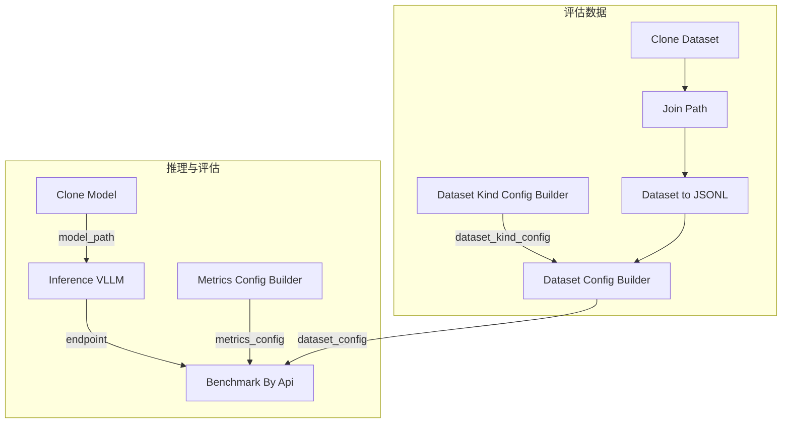

## 前置条件

- 已完成 [SFT 监督微调](/zh/docs/studio/sft-training)、[DPO 偏好对齐](/zh/docs/studio/dpo-training) 或 [GRPO 强化学习训练](/zh/docs/studio/grpo-training)
- 批量评估时需准备评估数据集（可使用 [加载和预处理数据集](/zh/docs/studio/load-preprocess-dataset) 中的相同流程）

## 验证方式概览

| 方式 | 适用场景 |
|------|----------|
| Benchmark 工作流 | 在固定评估集上批量调用推理 API，输出准确率等指标报告（推荐） |
| SFT 内置快速验证 | 训练完成后通过 **Merge LoRA** → **Inference (VLLM)** → **LLM Test** 快速抽检（见 [SFT 监督微调 — 训练后快速验证](/zh/docs/studio/sft-training#训练后快速验证)） |
| 验证集分支 | 在工作流中保留验证集，对比预测与标签 |
| 人工抽检 | 检查格式、逻辑与安全等难以自动量化的方面 |

## 使用 Benchmark 工作流评估

### 导入工作流

1. 下载 Benchmark 工作流：<a href="/resource/studio/jsons/Benchmark.json" target="_blank" rel="noreferrer">Benchmark</a>
2. 将 JSON 文件拖入 Studio 画布。
3. 按下方说明配置各节点参数。


### 工作流节点说明

Benchmark 工作流通过 vLLM 启动推理服务，再调用 **Benchmark By Api** 节点批量评估模型：

| 节点 | 说明 |
|------|------|
| Clone Dataset / Join Path / Dataset to JSONL | 加载评估数据集（示例：`openai/gsm8k` → `main/test-00000-of-00001.parquet`） |
| Dataset Kind Config Builder (Text Only) | 配置字段映射（示例：`question` / `answer`） |
| Dataset Config Builder | 汇总数据路径与 `dataset_kind_config` |
| Clone Model | 拉取待评估模型到本地（示例：`Qwen/Qwen3-0.6B`） |
| Inference (VLLM) | 启动 vLLM 推理服务，输出 OpenAI 兼容 API 端点 |
| Metrics Config Builder | 配置评估指标（System Entry 或 Custom Entry） |
| Benchmark By Api | 批量调用推理 API，计算指标并输出报告 |

<Note>
工作流支持两种推理来源：通过 **Clone Model** + **Inference (VLLM)** 在画布内启动服务，或将 **Benchmark By Api** 的 `endpoint` 指向已部署的 [Inference](/zh/docs/basic/inference) 服务。
</Note>

### 典型连接方式



各节点端口对应关系：

| 源节点 | 输出端口 | 目标节点 | 输入端口 |
|--------|----------|----------|----------|
| Join Path / Dataset to JSONL | 数据路径 | Dataset Config Builder | `train_data_path` |
| Dataset Kind Config Builder | `dataset_kind_config` | Dataset Config Builder | `dataset_kind_config` |
| Dataset Config Builder | `dataset_config` | Benchmark By Api | `dataset_config` |
| Metrics Config Builder | `metrics_config` | Benchmark By Api | `metrics_config` |
| Clone Model | `model_path` | Inference (VLLM) | `model_path` |
| Inference (VLLM) | `endpoint` | Benchmark By Api | `endpoint` |

### 配置评估参数

**数据集** — 在 **Dataset Kind Config Builder (Text Only)** 中配置字段映射，输出连接到 **Dataset Config Builder** 的 `dataset_kind_config`：

| 参数 | 说明 |
|------|------|
| `user_prompt_field` | 输入字段（GSM8K 示例：`question`） |
| `assistant_response_field` | 标签字段（GSM8K 示例：`answer`） |

将 **Join Path** 拼接后的路径连接到 **Dataset Config Builder** 的 `train_data_path`。

**推理服务** — 在 **Inference (VLLM)** 节点中配置：

| 参数 | 说明 |
|------|------|
| `model_path` | 由 **Clone Model** 的 `model_path` 连线传入，或手动填写 checkpoint 路径 |
| `port` | 服务端口，默认 `3000` |
| `gpu_count` / `gpu_product` | GPU 数量与型号 |

**评估指标** — 通过 **Metrics Config Builder** 配置指标入口与报告名称。

#### 内置指标（System Entry）

Benchmark 工作流默认使用 **Metrics Config Builder (System Entry)**，从预置函数中选择 `entry`：

| 参数 | 说明 |
|------|------|
| `entry` | 预置指标函数，如 `compute_gsm8k` |
| `name` | 指标名称，写入报告（GSM8K 示例：`acc`） |

可选预置指标：

| `entry` | 说明 |
|---------|------|
| `compute_gsm8k` | GSM8K 数学题准确率 |
| `compute_accuracy` | 文本精确匹配准确率 |
| `compute_bleu` | BLEU 分数 |
| `compute_rouge_l` | ROUGE-L 分数 |

#### 自定义指标（Custom Entry）

若预置指标不满足任务需求，可添加 **Metrics Config Builder (Custom Entry)** 节点，在 `entry` 中填写 Python 函数的绝对路径：

```
{文件绝对路径}:{函数名}
```

示例：

```
/workspace/test-for-workflow/examples/eval_metrics.py:compute_accuracy
```

同时配置 `name`，用于报告中的指标键名。

#### 函数实现示例

自定义指标函数接收单条样本的 ground truth、模型预测与原始样本，返回指标字典（或 `None` 表示跳过）。精确匹配准确率示例：

```python
from typing import Any


def compute_accuracy(
    gt_text: str,
    pred_text: str,
    sample: dict,
    *,
    metrics_name: str | None = None,
) -> dict | None:
    """精确匹配准确率（0 或 1）。"""
    def _result(score: float, metrics_name: str | None, default_key: str, **extra: Any) -> dict:
        key = _metric_key(metrics_name, default_key)
        out: dict[str, Any] = {key: float(score)}
        out.update(extra)
        return out
    gt = _normalize_whitespace(gt_text)
    pred = _normalize_whitespace(pred_text)
    return _result(1.0 if gt == pred else 0.0, metrics_name, "accuracy")
```


**Benchmark By Api**：

| 参数 | 说明 |
|------|------|
| `endpoint` | 推理 API 地址（由 **Inference (VLLM)** 的 `endpoint` 连线传入，或填写已部署服务 URL） |
| `endpoint_api_key` | API 密钥，默认 `empty` |
| `endpoint_model` | 模型名称，默认 `default` |
| `output_path` | 评估报告输出目录 |
| `max_samples` | 评估样本上限，`0` 表示不限制（示例工作流默认 `10`） |
| `max_tokens` | 单次生成最大 token 数，默认 `256` |
| `temperature` | 采样温度，默认 `0.01` |

### 运行评估

1. 确认数据集路径、模型路径与指标配置正确。
2. 若使用画布内推理，确保 **Inference (VLLM)** 与 **Benchmark By Api** 的 `endpoint` 已连线。
3. 点击 **运行**，等待评估完成。
4. 在 `output_path` 目录查看 benchmark 报告。

### 多阶段对比实验

在相同评估集与相同推理配置下，分别评估以下阶段的模型：

| 阶段 | 说明 |
|------|------|
| 基座模型 | 未经微调的预训练模型 |
| SFT | 监督微调后的模型 |
| DPO | 偏好对齐后的模型 |
| GRPO | 强化学习优化后的模型 |

参考 [博客 — Compute-Use VLM 评估结果](/zh/blog/compute-use/windows-computer-use#51-评估结果) 了解多阶段对比的实践案例。

## 训练后快速验证

SFT 工作流内置训练后快速验证链路，详见 [SFT 监督微调 — 训练后快速验证](/zh/docs/studio/sft-training#训练后快速验证)。

## 其他验证方式

### 工作流内验证集评估

1. 在工作流中保留或添加 **验证集** 分支。
2. 加载待评估的 checkpoint。
3. 在验证集上运行推理节点，收集预测结果。
4. 对比验证集标签，计算准确率、格式通过率、任务成功率等指标。

### 人工抽检

对关键样本进行人工检查：

- 输出是否符合格式规范
- 多步任务是否逻辑连贯
- 是否存在安全或稳定性问题

## 迭代建议

- 验证指标未达标时，优先检查 [数据集质量](/zh/docs/studio/preview-dataset) 与预处理逻辑。
- SFT 不足时可调整数据量或训练轮数；GRPO 不稳定时可 revisiting [reward 函数](/zh/docs/studio/reward-function)。
- 记录每次实验的 checkpoint、超参与指标，便于复现。

## 产出物

- Benchmark 评估指标报告（保存在 `output_path` 指定目录）
- 各样本的预测结果与得分明细

## 下一步

- [模型的推理和服务](/zh/docs/studio/model-inference-deployment) — 验证通过后部署模型
