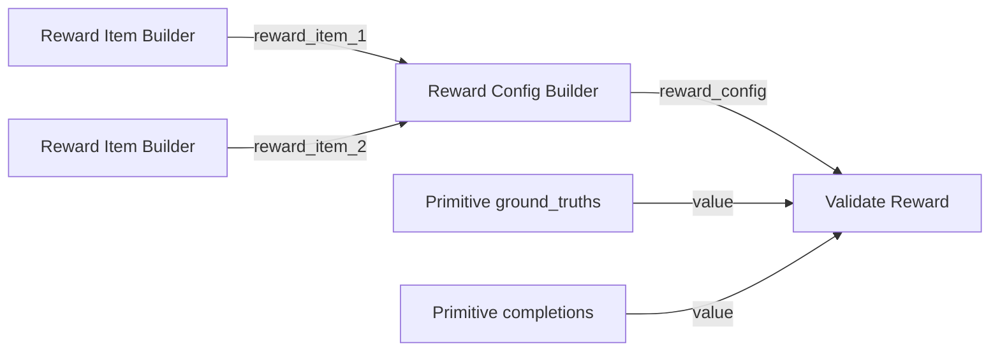

## 前置条件

- 了解任务的评价标准（格式正确性、操作准确度、任务完成率等）

## Reward 函数的作用

在 **GRPO（组相对策略优化）** 阶段，模型对同一输入生成多组候选输出，reward 函数为每组输出打分，用于计算组内相对偏好并更新策略。

Reward 设计应满足：

- **可自动计算**：无需人工逐条标注，适合批量训练
- **客观可复现**：相同输入与输出始终得到相同分数
- **与任务目标对齐**：分数高意味着更接近期望行为

## 常见 reward 设计思路

| 任务类型 | Reward 参考维度 |
|----------|----------------|
| GUI Agent | 操作格式合法性、坐标范围、是否匹配目标 UI 元素 |
| VLM / 几何推理 | 思考标签格式、答案数值准确性 |
| 文本生成 | 格式约束（JSON / 标签闭合）、关键词命中、长度惩罚 |
| 代码 / 推理 | 单元测试通过率、答案数值误差、步骤完整性 |

## 在 Studio 中配置

GRPO 工作流通过 **Reward Item Builder** 与 **Reward Config Builder** 节点挂载 reward 逻辑：

1. 打开 GRPO 工作流（<a href="/resource/studio/jsons/GRPO.json" target="_blank" rel="noreferrer">GRPO</a>）。
2. 在 **Reward Item Builder** 节点中配置每个 reward 项：

| 参数 | 说明 |
|------|------|
| `entry` | Reward 函数入口。System Entry 选预置函数名；Custom Entry 填 `{绝对路径}:{函数名}` |
| `name` | Reward 项名称，用于日志与调试 |
| `weight` | 该项在总 reward 中的权重 |
| `kwargs` | 传递给 reward 函数的额外参数（JSON 字符串） |

3. 将多个 **Reward Item Builder** 的输出连接到 **Reward Config Builder**，最多支持 5 个 reward 项。
4. 将 **Reward Config Builder** 的 `reward_config` 输出连接到 **GRPO Training** 节点。
5. 启动 GRPO 训练前，建议先用 [Validate-Reward 工作流](#验证-reward-函数) 验证 reward 打分是否符合预期。


## 示例配置

### 内置 reward（System Entry）

GRPO 工作流默认包含两个 **Reward Item Builder (System Entry)** 节点（Geometry VQA 场景）：

| `name` | `entry` | 说明 |
|--------|---------|------|
| `thinking_tags` | `geometry_vqa_thinking_reward` | 校验模型输出中的思考标签格式 |
| `answer_acc` | `geometry_vqa_answer_reward` | 评估答案是否与标准答案一致 |

`entry` 从平台预置函数中选择，无需填写文件路径。

### 自定义 reward（Custom Entry）

若内置 reward 不满足任务需求，可添加 **Reward Item Builder (Custom Entry)** 节点，或将现有节点切换为 Custom Entry，在 `entry` 中填写 Python 函数的绝对路径：

```
{文件绝对路径}:{函数名}
```

示例：

```
/workspace/test-for-workflow/examples/reward.py:geometry_vqa_answer_reward
```

同时按需配置 `name`（名称）与 `weight`（权重）。

### 函数实现示例

自定义 reward 函数及其依赖的辅助函数均需在同一 Python 文件中自行实现。函数需接受模型输出批次并返回与样本数等长的分数列表。Geometry VQA 答案匹配示例：

```python
from typing import Any


def geometry_vqa_answer_reward(
    completions: list[Any],
    ground_truth: list[str] | None = None,
    **kwargs: Any,
) -> list[float]:
    """预测答案字母与 ground_truth 一致时返回 1.0，否则返回 0.0。"""
    del kwargs
    flat = _flatten_completions(completions)
    gts = _normalize_ground_truth(ground_truth, len(flat))
    scores: list[float] = []
    for comp, gt in zip(flat, gts):
        pred = extract_answer_letter(comp)
        ref = extract_answer_letter(gt)
        scores.append(1.0 if pred is not None and ref is not None and pred == ref else 0.0)
    return scores
```

<Note>
上述辅助函数（如 `_flatten_completions`、`extract_answer_letter` 等）需在同一 Python 文件中自行实现。将文件保存到工作区后，在 **Reward Item Builder (Custom Entry)** 的 `entry` 中填写该文件的绝对路径与入口函数名。GUI Agent 场景的 GRPO 原理可参考 [博客 — Compute-Use VLM](/zh/blog/compute-use/windows-computer-use#32-强化学习)。
</Note>

## 验证 reward 函数

在启动 GRPO 训练前，推荐使用 **Validate-Reward** 工作流，用少量样本快速验证 reward 配置与打分逻辑是否正确。

### 导入工作流

1. 下载 Validate-Reward 工作流：<a href="/resource/studio/jsons/Validate-Reward.json" target="_blank" rel="noreferrer">Validate-Reward</a>
2. 将 JSON 文件拖入 Studio 画布。
3. 按下方说明配置各节点并运行。


### 工作流节点说明

| 节点 | 说明 |
|------|------|
| Reward Item Builder (Custom Entry) | 配置待验证的 reward 项（`entry`、`name`、`weight`） |
| Reward Config Builder | 组合多个 reward 项，生成 `reward_config` |
| Validate Reward | 加载 reward 配置，对给定 `ground_truths` 与 `completions` 计算分数 |
| Primitive | 提供测试用的 `ground_truths` 或 `completions` 文本（也可直接在 **Validate Reward** 节点中填写） |

### 典型连接方式



### 配置与运行

1. 在 **Reward Item Builder (Custom Entry)** 中填写自定义 reward 的 `entry` 与 `name`（示例工作流包含 `think_reward` 与 `answer_reward` 两项）。
2. 将 **Reward Item Builder** 的输出连接到 **Reward Config Builder** 的 `reward_item_1`、`reward_item_2` 等输入。
3. 在 **Validate Reward** 节点或 **Primitive** 节点中填写测试数据：
   - `ground_truths` — 标准答案，每行一条样本
   - `completions` — 模型输出，每行一条样本，行数需与 `ground_truths` 对齐
4. 点击 **运行**，查看 **Validate Reward** 节点输出：
   - `status` — 验证是否成功
   - `scores` — 各样本的 reward 分数

示例工作流中的测试数据（Geometry VQA 格式）：

```
# ground_truths（两行）
<think>...</think><answer>22</answer>
<think>...</think><answer>2</answer>

# completions（两行，第一条答案正确，第二条答案错误）
<answer>22</answer>
<think>...</think><answer>12</answer>
```

运行后，`scores` 中第一条样本的 `answer_reward` 应高于第二条，说明 reward 能区分正确与错误输出。确认无误后，再将相同的 **Reward Item Builder** 配置复制到 [GRPO 工作流](/zh/docs/studio/grpo-training) 中使用。

## 下一步

- [GRPO 强化学习训练](/zh/docs/studio/grpo-training) — 使用 reward 函数启动强化学习训练
