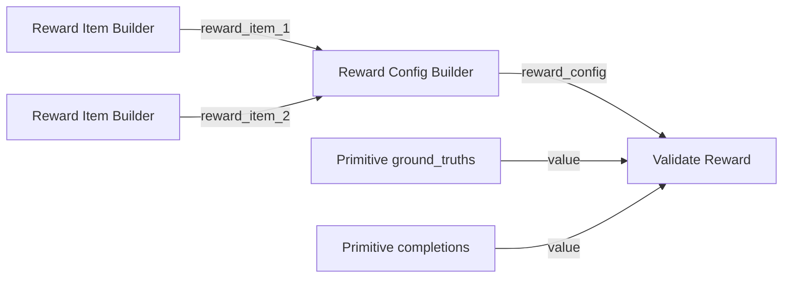

## Prerequisites

- You understand your task's evaluation criteria (format correctness, action accuracy, task success rate, and more)

## Why reward functions matter

During **GRPO (Group Relative Policy Optimization)**, the model generates multiple candidate outputs for the same input. Reward functions score each candidate so the trainer can compute within-group preferences and update policy weights.

A well-designed reward should be:

- **Automatically computable**: Supports large-scale training without manual labeling
- **Objective and reproducible**: The same input/output always yields the same score
- **Aligned to business goals**: Higher scores reflect closer alignment with desired behavior

## Common reward design patterns

| Task type | Reward dimensions |
|----------|----------------|
| GUI Agent | Action format validity, coordinate bounds, match quality against target UI elements |
| VLM / geometric reasoning | Reasoning tag format, answer value accuracy |
| Text generation | Format constraints (JSON/tag closure), keyword coverage, length penalties |
| Code / reasoning | Unit test pass rate, numeric error, step completeness |

## Configure in Studio

The GRPO workflow uses **Reward Item Builder** and **Reward Config Builder** to mount reward logic:

1. Open the GRPO workflow (<a href="/resource/studio/jsons/GRPO.json" target="_blank" rel="noreferrer">GRPO</a>).
2. Configure each reward item in **Reward Item Builder**:

| Parameter | Description |
|------|------|
| `entry` | Reward function entry. For System Entry, choose a built-in function; for Custom Entry, provide `{absolute_path}:{function_name}` |
| `name` | Reward item name used in logs and debugging |
| `weight` | Weight of this item in total reward |
| `kwargs` | Additional JSON-string parameters passed to the reward function |

3. Connect outputs of multiple **Reward Item Builder** nodes into **Reward Config Builder** (up to 5 reward items).
4. Connect `reward_config` output from **Reward Config Builder** to **GRPO Training**.
5. Before running GRPO, validate reward behavior with the [Validate-Reward workflow](#validate-reward-functions).


## Example configurations

### Built-in rewards (System Entry)

The default GRPO workflow includes two **Reward Item Builder (System Entry)** nodes for the Geometry VQA scenario:

| `name` | `entry` | Description |
|--------|---------|------|
| `thinking_tags` | `geometry_vqa_thinking_reward` | Validate reasoning-tag format in model outputs |
| `answer_acc` | `geometry_vqa_answer_reward` | Evaluate answer match against ground truth |

For System Entry, choose `entry` from built-in functions; no file path is required.

### Custom rewards (Custom Entry)

If built-in rewards are not sufficient, add a **Reward Item Builder (Custom Entry)** node, or switch an existing node to Custom Entry, then set `entry` as:

```
{absolute_file_path}:{function_name}
```

Example:

```
/workspace/test-for-workflow/examples/reward.py:geometry_vqa_answer_reward
```

Set `name` and `weight` as needed.

### Function implementation example

Both custom reward functions and their helper functions should be implemented in the same Python file. The function should accept a batch of model outputs and return a score list with the same length as the sample batch. Example for Geometry VQA answer matching:

```python
from typing import Any


def geometry_vqa_answer_reward(
    completions: list[Any],
    ground_truth: list[str] | None = None,
    **kwargs: Any,
) -> list[float]:
    """Return 1.0 when predicted answer matches ground_truth, else 0.0."""
    del kwargs
    flat = _flatten_completions(completions)
    gts = _normalize_ground_truth(ground_truth, len(flat))
    scores: list[float] = []
    for comp, gt in zip(flat, gts):
        pred = extract_answer_letter(comp)
        ref = extract_answer_letter(gt)
        scores.append(1.0 if pred is not None and ref is not None and pred == ref else 0.0)
    return scores
```

<Note>
Helper functions shown above (such as `_flatten_completions`, `extract_answer_letter`) must also be implemented in the same Python file. Save the file in your workspace, then set the absolute path and entry function name in **Reward Item Builder (Custom Entry)**. For GRPO concepts in GUI Agent scenarios, see [Blog - Compute-Use VLM](/blog/compute-use/windows-computer-use#32-强化学习).
</Note>

## Validate reward functions

Before launching GRPO, use the **Validate-Reward** workflow to quickly verify reward configuration and scoring behavior on a small sample set.

### Import workflow

1. Download the Validate-Reward workflow: <a href="/resource/studio/jsons/Validate-Reward.json" target="_blank" rel="noreferrer">Validate-Reward</a>
2. Drag the JSON file into the Studio canvas.
3. Configure each node and run as described below.


### Workflow nodes

| Node | Description |
|------|------|
| Reward Item Builder (Custom Entry) | Configure reward items to validate (`entry`, `name`, `weight`) |
| Reward Config Builder | Combine multiple reward items into `reward_config` |
| Validate Reward | Load reward config and score given `ground_truths` and `completions` |
| Primitive | Provide test `ground_truths` or `completions` text (or enter directly in **Validate Reward**) |

### Typical connection pattern



### Configure and run

1. In **Reward Item Builder (Custom Entry)**, fill in `entry` and `name` for custom rewards (the sample workflow includes `think_reward` and `answer_reward`).
2. Connect **Reward Item Builder** outputs to inputs such as `reward_item_1`, `reward_item_2` in **Reward Config Builder**.
3. In **Validate Reward** or **Primitive** nodes, provide test data:
   - `ground_truths` - One ground-truth answer per line
   - `completions` - One model output per line, aligned line-by-line with `ground_truths`
4. Click **Run** and check outputs from **Validate Reward**:
   - `status` - Whether validation succeeds
   - `scores` - Reward scores per sample

Sample test data in the example workflow (Geometry VQA format):

```
# ground_truths (2 lines)
<think>...</think><answer>22</answer>
<think>...</think><answer>2</answer>

# completions (2 lines; first correct, second incorrect)
<answer>22</answer>
<think>...</think><answer>12</answer>
```

After execution, `answer_reward` for the first sample should be higher than the second, showing that the reward differentiates correct and incorrect outputs. Once validated, copy the same **Reward Item Builder** configuration into the [GRPO workflow](/docs/studio/grpo-training).

## Next steps

- [Train with GRPO](/docs/studio/grpo-training) - Launch reinforcement learning with your reward functions
