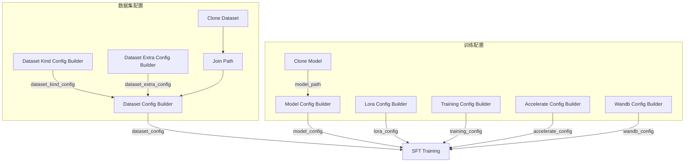
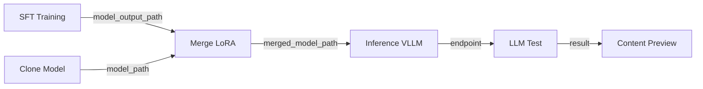

## 前置条件

- 已完成 [预览数据集](/zh/docs/studio/preview-dataset)
- 账户有足够 GPU 配额（见 [用户配置](/zh/docs/basic/user_profile#第四步：查看配额与资源限制)）

## 导入 SFT 工作流

1. 下载示例工作流：<a href="/resource/studio/jsons/SFT.json" target="_blank" rel="noreferrer">SFT</a>
2. 将 JSON 文件拖入 Studio 画布。
3. 按下方说明配置各节点参数。

## 工作流节点说明

SFT 工作流通过多个 Config Builder 节点组装训练配置，最终汇入 **SFT Training** 节点执行训练：

| 节点 | 说明 |
|------|------|
| Clone Dataset / Join Path | 加载并定位训练数据文件（示例：`pyromind/self-cognition` → `self-cognition.jsonl`） |
| Clone Model | 拉取基座模型到本地（示例：`Qwen/Qwen3-0.6B`） |
| Dataset Kind Config Builder (Text Only) | 纯文本字段映射（示例：`user_prompt_field: user_prompt`，`assistant_response_field: gt`） |
| Dataset Config Builder | 汇总数据路径与 `dataset_kind_config`，生成 `dataset_config` |
| Dataset Extra Config Builder | 序列长度、采样上限、collator 入口等 |
| Model Config Builder | 模型路径与类型（`model_path`、`model_type`） |
| Lora Config Builder | LoRA rank、dropout、目标模块等 |
| Training Config Builder | 学习率、batch size、epoch、保存步数等超参数 |
| Accelerate Config Builder | 分布式训练与 ZeRO 配置 |
| Wandb Config Builder | 训练日志与实验追踪（可选） |
| SFT Training | 执行监督微调训练 |
| Merge LoRA | 将 LoRA 适配器合并到基座权重，输出独立模型目录 |
| Inference (VLLM) | 启动 vLLM 推理服务 |
| LLM Test | 向推理端点发送测试 prompt，返回生成结果 |
| Content Preview | 预览 **LLM Test** 的输出内容 |

<Note>
**Clone Model** 的 `model_path` 输出直接连接到 **Model Config Builder** 的 `model_path`，自动填入本地模型路径。LoRA 相关参数已独立到 **Lora Config Builder** 节点。
</Note>

## 典型连接方式

SFT 工作流采用 Config Builder 模式：各 Builder 输出 YAML 字符串，汇入 **SFT Training** 节点。

**Dataset Kind Config Builder** 负责字段映射（如 `user_prompt_field`、`assistant_response_field`），其 `dataset_kind_config` 输出连接到 **Dataset Config Builder** 的同名输入。

| 源节点 | 输出端口 | 目标节点 | 输入端口 |
|--------|----------|----------|----------|
| Join Path | `joined_path` | Dataset Config Builder | `train_data_path` |
| Dataset Kind Config Builder | `dataset_kind_config` | Dataset Config Builder | `dataset_kind_config` |
| Dataset Extra Config Builder | `dataset_extra_config` | Dataset Config Builder | `dataset_extra_config` |
| Dataset Config Builder | `dataset_config` | SFT Training | `dataset_config` |
| Model Config Builder | `model_config` | SFT Training | `model_config` |
| Lora Config Builder | `lora_config` | SFT Training | `lora_config` |
| Training Config Builder | `training_config` | SFT Training | `training_config` |
| Accelerate Config Builder | `accelerate_config` | SFT Training | `accelerate_config` |
| Wandb Config Builder | `wandb_config` | SFT Training | `wandb_config` |
| Clone Model | `model_path` | Model Config Builder | `model_path` |

## 训练后快速验证

SFT 工作流在训练节点之后串联了合并与推理验证链路：

1. **SFT Training** 的 `model_output_path` 连接到 **Merge LoRA** 的 `lora_path`。
2. **Clone Model** 的 `model_path` 同时连接到 **Merge LoRA** 的 `model_path`（基座模型路径）。
3. **Merge LoRA** 合并后的 `merged_model_path` 传入 **Inference (VLLM)**。
4. **Inference (VLLM)** 的 `endpoint` 连接到 **LLM Test**，可在 **Content Preview** 中查看回复。

## 配置训练参数

| 参数 | 节点 | 说明 |
|------|------|------|
| 基座模型 | Clone Model | 选择预训练模型，`model_path` 连线到 **Model Config Builder** |
| 模型路径 | Model Config Builder | `model_path` 必填，通常由 **Clone Model** 连线传入 |
| 模型类型 | Model Config Builder | `model_type` 默认 `auto`，可选 `qwen3vl`、`qwen3.5` |
| 合并输出 | Merge LoRA | `output_path` 指定合并后模型保存目录 |
| LoRA | Lora Config Builder | `lora_rank` 默认 8，`lora_dropout` 默认 0.05 |
| 目标模块 | Lora Config Builder | 默认 `q_proj,k_proj,v_proj,o_proj,gate_proj,up_proj,down_proj` |
| 学习率 | Training Config Builder | 默认 `1e-4` |
| Batch size / grad_accum | Training Config Builder | 默认均为 2 |
| Epoch | Training Config Builder | `num_epochs` 默认 1 |
| 保存策略 | Training Config Builder | `save_steps` 500，`save_total_limit` 3 |
| GPU | SFT Training | 选择 GPU 型号与数量 |

## 运行训练

1. 检查各 Config Builder 节点连线与参数，确认 **SFT Training** 的 `output_path` 已设置 checkpoint 保存目录。
2. 点击 **运行**，等待任务完成。
3. 在任务详情中查看 loss 曲线与日志（若已配置 WandB）。

## 产出物

训练完成后，工作流通常输出：

- 微调后的模型权重（或 LoRA 适配器），保存在 `output_path` 指定目录
- 训练日志与 checkpoint 路径

## 下一步

- [DPO 偏好对齐](/zh/docs/studio/dpo-training) — 基于偏好对数据进一步优化（可选）
- [编写 reward 函数](/zh/docs/studio/reward-function) — 为 GRPO 强化学习准备奖励逻辑
- [GRPO 强化学习训练](/zh/docs/studio/grpo-training) — 在 SFT 基础上继续优化
- [模型的验证](/zh/docs/studio/model-validation) — Benchmark 批量评估与快速验证
