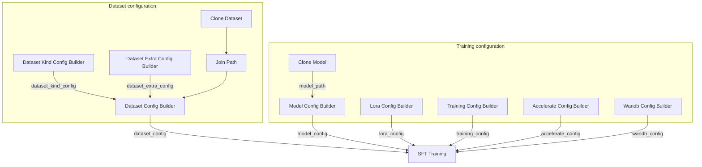
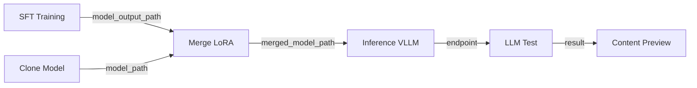

## Prerequisites

- You have completed [Preview dataset](/docs/studio/preview-dataset)
- Your account has sufficient GPU quota (see [User profile](/docs/basic/user_profile))

## Import the SFT workflow

1. Download the sample workflow: <a href="/resource/studio/jsons/SFT.json" target="_blank" rel="noreferrer">SFT</a>
2. Drag the JSON file into the Studio canvas.
3. Configure each node as described below.

## Workflow nodes

The SFT workflow assembles training configs through multiple Config Builder nodes, then runs training in **SFT Training**:

| Node | Description |
|------|------|
| Clone Dataset / Join Path | Load and locate training data files (example: `pyromind/self-cognition` -> `self-cognition.jsonl`) |
| Clone Model | Pull a base model to local storage (example: `Qwen/Qwen3-0.6B`) |
| Dataset Kind Config Builder (Text Only) | Text-only field mapping (example: `user_prompt_field: user_prompt`, `assistant_response_field: gt`) |
| Dataset Config Builder | Combine data paths and `dataset_kind_config` to produce `dataset_config` |
| Dataset Extra Config Builder | Sequence length, sample caps, collator entry, and more |
| Model Config Builder | Model path and model type (`model_path`, `model_type`) |
| Lora Config Builder | LoRA rank, dropout, target modules, and more |
| Training Config Builder | Hyperparameters such as learning rate, batch size, epochs, save steps |
| Accelerate Config Builder | Distributed training and ZeRO configuration |
| Wandb Config Builder | Training logs and experiment tracking (optional) |
| SFT Training | Execute supervised fine-tuning |
| Merge LoRA | Merge LoRA adapters into base weights and output a standalone model directory |
| Inference (VLLM) | Start a vLLM inference service |
| LLM Test | Send test prompts to the inference endpoint and return outputs |
| Content Preview | Preview outputs from **LLM Test** |

<Note>
The `model_path` output from **Clone Model** is connected directly to `model_path` in **Model Config Builder**, automatically filling the local model path. LoRA parameters are configured separately in **Lora Config Builder**.
</Note>

## Typical connection pattern

The SFT workflow uses the Config Builder pattern: each Builder outputs a YAML string that feeds **SFT Training**.

**Dataset Kind Config Builder** handles field mapping (for example, `user_prompt_field`, `assistant_response_field`). Connect its `dataset_kind_config` output to the same-named input on **Dataset Config Builder**.

| Source node | Output port | Target node | Input port |
|--------|----------|----------|----------|
| Join Path | `joined_path` | Dataset Config Builder | `train_data_path` |
| Dataset Kind Config Builder | `dataset_kind_config` | Dataset Config Builder | `dataset_kind_config` |
| Dataset Extra Config Builder | `dataset_extra_config` | Dataset Config Builder | `dataset_extra_config` |
| Dataset Config Builder | `dataset_config` | SFT Training | `dataset_config` |
| Model Config Builder | `model_config` | SFT Training | `model_config` |
| Lora Config Builder | `lora_config` | SFT Training | `lora_config` |
| Training Config Builder | `training_config` | SFT Training | `training_config` |
| Accelerate Config Builder | `accelerate_config` | SFT Training | `accelerate_config` |
| Wandb Config Builder | `wandb_config` | SFT Training | `wandb_config` |
| Clone Model | `model_path` | Model Config Builder | `model_path` |

## Quick post-training validation

The SFT workflow includes a merge and inference validation chain after training:

1. Connect `model_output_path` from **SFT Training** to `lora_path` in **Merge LoRA**.
2. Connect `model_path` from **Clone Model** to `model_path` in **Merge LoRA** (base model path).
3. Pass `merged_model_path` from **Merge LoRA** into **Inference (VLLM)**.
4. Connect `endpoint` from **Inference (VLLM)** to **LLM Test** and review responses in **Content Preview**.

## Configure training parameters

| Parameter | Node | Description |
|------|------|------|
| Base model | Clone Model | Select a pretrained model; connect `model_path` to **Model Config Builder** |
| Model path | Model Config Builder | `model_path` is required and is usually provided by **Clone Model** |
| Model type | Model Config Builder | `model_type` defaults to `auto`; optional values include `qwen3vl`, `qwen3.5` |
| Merge output | Merge LoRA | `output_path` specifies where merged model files are saved |
| LoRA | Lora Config Builder | `lora_rank` defaults to 8, `lora_dropout` defaults to 0.05 |
| Target modules | Lora Config Builder | Default: `q_proj,k_proj,v_proj,o_proj,gate_proj,up_proj,down_proj` |
| Learning rate | Training Config Builder | Default: `1e-4` |
| Batch size / grad_accum | Training Config Builder | Both default to 2 |
| Epochs | Training Config Builder | `num_epochs` defaults to 1 |
| Save strategy | Training Config Builder | `save_steps` 500, `save_total_limit` 3 |
| GPU | SFT Training | Select GPU model and count |

## Run training

1. Check all Config Builder connections and parameters, and confirm `output_path` in **SFT Training** is set for checkpoint output.
2. Click **Run** and wait for completion.
3. Review loss curves and logs in task details (and WandB if configured).

## Artifacts

After training, the workflow usually outputs:

- Fine-tuned model weights (or LoRA adapters) in the configured `output_path`
- Training logs and checkpoint paths

## Next steps

- [Train with DPO](/docs/studio/dpo-training) - Further optimize with preference data (optional)
- [Write reward functions](/docs/studio/reward-function) - Prepare reward logic for GRPO
- [Train with GRPO](/docs/studio/grpo-training) - Continue optimization on top of SFT
- [Model validation](/docs/studio/model-validation) - Benchmark batch evaluation and quick checks
